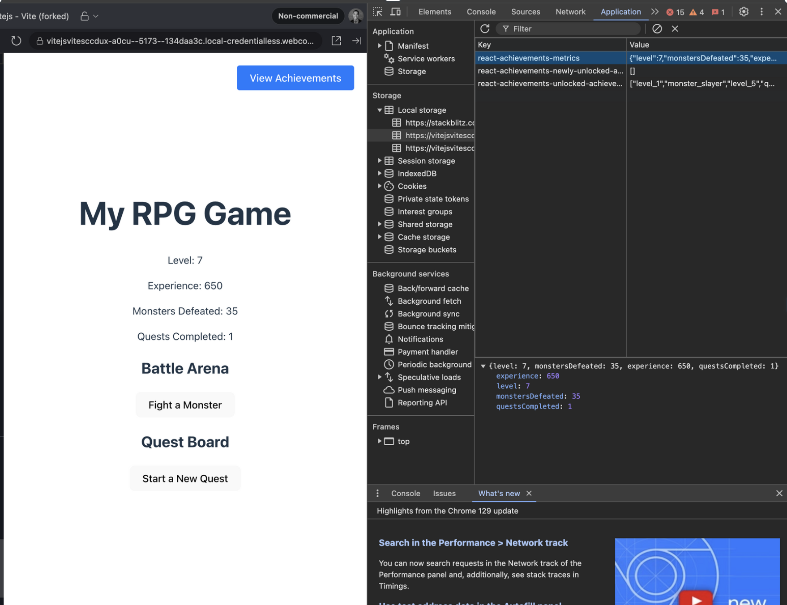

<h1 align="center">🏆 React-Achievements 🏆</h1>


A flexible and customizable achievement system for React applications, perfect for adding gamification elements to your projects.

[](https://youtu.be/BWdtiE53S-8)

If you want to test the package, you can try it out here:

https://stackblitz.com/edit/vitejs-vite-sccdux


<h2 align="center">🚀 Installation</h2>

Install `react-achievements` using npm or yarn:

```bash
npm install react-achievements
```

or

```bash
yarn add react-achievements
```

<h2 align="center">🎮 Usage</h2>

Let's walk through setting up a simple RPG-style game with achievements using React-Achievements.

<h3 align="center">🛠 Set up the AchievementProvider</h3>

First, wrap your app or a part of your app with the AchievementProvider:

```jsx
import React from 'react';
import { AchievementProvider } from 'react-achievements';
import achievementConfig from './achievementConfig';
import Game from './Game';

const initialState = {
  level: 1,
  experience: 0,
  monstersDefeated: 0,
  questsCompleted: 0
};

function App() {
  return (
    <AchievementProvider 
      config={achievementConfig} 
      initialState={initialState}
      badgesButtonPosition="top-right"
    >
      <Game />
    </AchievementProvider>
  );
}

export default App;
```

<h3 align="center">📝 Create an achievement configuration</h3>

Create a file (e.g., achievementConfig.js) to define your achievements:

```javascript
import levelUpIcon from './icons/level-up.png';
import monsterSlayerIcon from './icons/monster-slayer.png';
import questMasterIcon from './icons/quest-master.png';

const achievementConfig = {
  level: [
    {
      check: (value) => value >= 1,
      data: {
        id: 'level_1',
        title: 'Novice Adventurer',
        description: 'Reached level 1',
        icon: levelUpIcon
      }
    },
    {
      check: (value) => value >= 5,
      data: {
        id: 'level_5',
        title: 'Seasoned Warrior',
        description: 'Reached level 5',
        icon: levelUpIcon
      }
    }
  ],
  monstersDefeated: [
    {
      check: (value) => value >= 10,
      data: {
        id: 'monster_slayer',
        title: 'Monster Slayer',
        description: 'Defeated 10 monsters',
        icon: monsterSlayerIcon
      }
    }
  ],
  questsCompleted: [
    {
      check: (value) => value >= 1,
      data: {
        id: 'quest_master',
        title: 'Quest Master',
        description: 'Completed 1 quest',
        icon: questMasterIcon
      }
    }
  ]
};

export default achievementConfig;
```

<h3 align="center">🎣 Use the useAchievement hook</h3>

In your game components, use the useAchievement hook to update metrics and trigger achievement checks:
```jsx
import React, { useState } from 'react';
import { useAchievement } from 'react-achievements';

function Game() {
  const { setMetrics, metrics } = useAchievement();
  const [currentQuest, setCurrentQuest] = useState(null);

  const defeatMonster = () => {
    setMetrics(prevMetrics => {
      const newExperience = prevMetrics.experience + 10;
      const newLevel = Math.floor(newExperience / 100) + 1;
      return {
        ...prevMetrics,
        monstersDefeated: prevMetrics.monstersDefeated + 1,
        experience: newExperience,
        level: newLevel > prevMetrics.level ? newLevel : prevMetrics.level
      };
    });
  };

  const completeQuest = () => {
    setMetrics(prevMetrics => {
      const newExperience = prevMetrics.experience + 50;
      const newLevel = Math.floor(newExperience / 100) + 1;
      return {
        ...prevMetrics,
        questsCompleted: prevMetrics.questsCompleted + 1,
        experience: newExperience,
        level: newLevel > prevMetrics.level ? newLevel : prevMetrics.level
      };
    });
    setCurrentQuest(null);
  };

  const startQuest = () => {
    setCurrentQuest("Defeat the Dragon");
  };

  return (
    <div>
      <h1>My RPG Game</h1>
      <p>Level: {metrics.level}</p>
      <p>Experience: {metrics.experience}</p>
      <p>Monsters Defeated: {metrics.monstersDefeated}</p>
      <p>Quests Completed: {metrics.questsCompleted}</p>
      
      <div>
        <h2>Battle Arena</h2>
        <button onClick={defeatMonster}>Fight a Monster</button>
      </div>

      <div>
        <h2>Quest Board</h2>
        {currentQuest ? (
          <>
            <p>Current Quest: {currentQuest}</p>
            <button onClick={completeQuest}>Complete Quest</button>
          </>
        ) : (
          <button onClick={startQuest}>Start a New Quest</button>
        )}
      </div>
    </div>
  );
}

export default Game;
```

<h2 align="center">✨ Features</h2>

- Flexible Achievement System: Define custom metrics and achievement conditions for your game or app.
- Automatic Achievement Tracking: Achievements are automatically checked and unlocked when metrics change.
- Achievement Notifications: A modal pops up when an achievement is unlocked, perfect for rewarding players.
- Persistent Achievements: Unlocked achievements and metrics are stored in local storage, allowing players to keep their progress.
- Achievement Gallery: Players can view all their unlocked achievements, encouraging completionism.
- Confetti Effect: A celebratory confetti effect is displayed when an achievement is unlocked, adding to the excitement.
- Local Storage: Achievements are stored locally on the device

<h2 align="center">🔧 API</h2>

<h3 align="center">🏗 AchievementProvider</h3>

#### Props:

- `config`: An object defining your metrics and achievements.
- `initialState`: The initial state of your metrics.
- `storageKey` (optional): A string to use as the key for localStorage. Default: 'react-achievements'
- `badgesButtonPosition` (optional): Position of the badges button. Default: 'top-right'
- `styles` (optional): Custom styles for the achievement components.

<h3 align="center">🪝 useAchievement Hook</h3>

#### Returns an object with:

- `setMetrics`: Function to update the metrics.
- `metrics`: Current metrics object.
- `unlockedAchievements`: Array of unlocked achievement IDs.
- `showBadgesModal`: Function to manually show the badges modal.

<h2 align="center">🎨 Customization</h2>

React-Achievements allows for extensive customization of its appearance. You can override the default styles by passing a `styles` prop to the `AchievementProvider`:

```jsx
const customStyles = {
  achievementModal: {
    overlay: {
      backgroundColor: 'rgba(0, 0, 0, 0.8)',
    },
    content: {
      backgroundColor: '#2a2a2a',
      color: '#ffffff',
    },
    title: {
      color: '#ffd700',
    },
    button: {
      backgroundColor: '#4CAF50',
    },
  },
  badgesModal: {
    // Custom styles for the badges modal
  },
  badgesButton: {
    // Custom styles for the badges button
  },
};

function App() {
  return (
    <AchievementProvider 
      config={achievementConfig} 
      initialState={initialState}
      styles={customStyles}
    >
      <Game />
    </AchievementProvider>
  );
}
```

### achievementModal

Customizes the modal that appears when an achievement is unlocked.

```
achievementModal: {
  overlay: {
    // Styles for the modal overlay (background)
    backgroundColor: 'rgba(0, 0, 0, 0.8)',
    // You can also customize other overlay properties like zIndex, transition, etc.
  },
  content: {
    // Styles for the modal content container
    backgroundColor: '#2a2a2a',
    color: '#ffffff',
    borderRadius: '10px',
    padding: '20px',
    // Add any other CSS properties for the content container
  },
  title: {
    // Styles for the achievement title
    fontSize: '24px',
    fontWeight: 'bold',
    color: '#ffd700',
  },
  icon: {
    // Styles for the achievement icon
    width: '64px',
    height: '64px',
    marginBottom: '10px',
  },
  description: {
    // Styles for the achievement description
    fontSize: '16px',
    marginTop: '10px',
  },
  button: {
    // Styles for the close button
    backgroundColor: '#4CAF50',
    color: 'white',
    padding: '10px 20px',
    border: 'none',
    borderRadius: '5px',
    cursor: 'pointer',
  },
}
```

### badgesModal

```
badgesModal: {
  overlay: {
    // Similar to achievementModal overlay
  },
  content: {
    // Similar to achievementModal content
  },
  title: {
    // Styles for the modal title
  },
  badgeContainer: {
    // Styles for the container holding all badges
    display: 'flex',
    flexWrap: 'wrap',
    justifyContent: 'center',
  },
  badge: {
    // Styles for individual badge containers
    margin: '10px',
    textAlign: 'center',
  },
  badgeIcon: {
    // Styles for badge icons
    width: '50px',
    height: '50px',
  },
  badgeTitle: {
    // Styles for badge titles
    fontSize: '14px',
    marginTop: '5px',
  },
  button: {
    // Styles for the close button (similar to achievementModal button)
  },
}
```


### badgesButton

```
badgesButton: {
  // Styles for the floating badges button
  position: 'fixed',
  padding: '10px 20px',
  backgroundColor: '#007bff',
  color: '#ffffff',
  border: 'none',
  borderRadius: '5px',
  cursor: 'pointer',
  zIndex: 1000,
  // You can add more CSS properties as needed. These are just regular CSS
}

```

<h2 align="center">Resetting React Achievements</h2>

The achievements are stored in local storage. In order to reset the package in your app, you need to delete the key-value pairs in local storage:




<h2 align="center">📄 License</h2>
MIT

React-Achievements provides a comprehensive achievement system for React applications, perfect for adding gamification elements to your projects. Whether you're building a game, an educational app, or any interactive experience, this package offers an easy way to implement and manage achievements, enhancing user engagement and retention.
